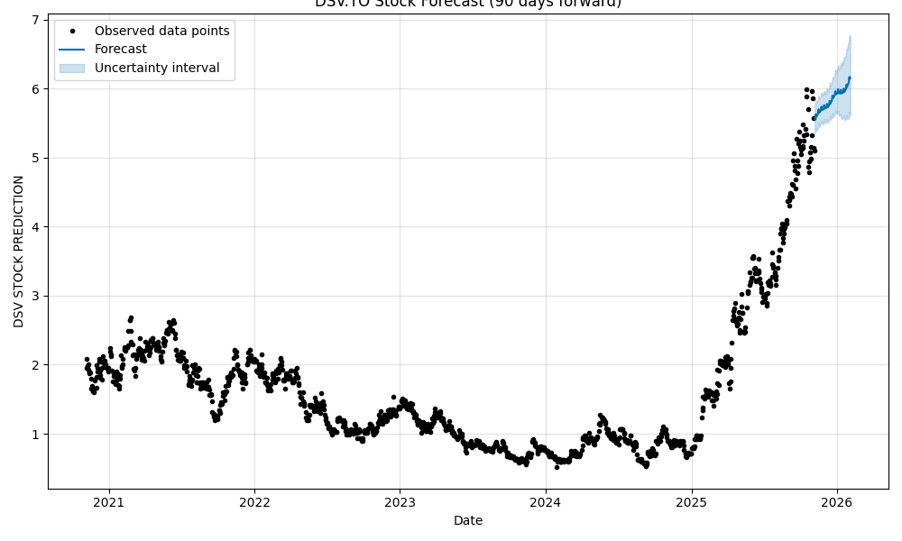
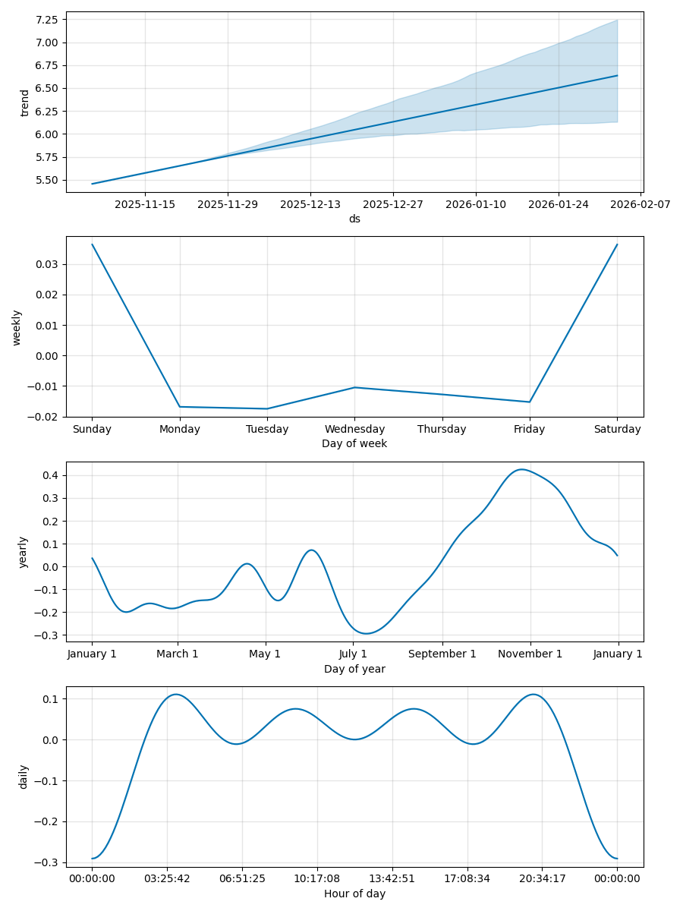

# Stock Price Prediction

A machine learning project for predicting stock prices using historical market data.

## Overview
This repository contains code and resources used to train and evaluate various machine learning models for forecasting stock prices. The workflow typically includes:
- Data collection (Yahoo Finance or other APIs)
- Data preprocessing (cleaning, scaling, feature engineering)
- Model building (LSTM, ARIMA, etc.)
- Model evaluation and prediction visualization

## Project Structure
```
├── data/                # Datasets and historical stock data
├── notebooks/           # Jupyter notebooks for experiments
├── src/                 # Source code for models and utilities
├── requirements.txt     # Project dependencies
└── README.md            # Project documentation
```

## Setup & Installation
1. Clone the repository:
```
$ git clone https://github.com/shalabyamr/Stock_Price_Prediction.git
$ cd Stock_Price_Prediction
```

2. Install dependencies:
```
$ pip install -r requirements.txt
```

## Usage
Run the main notebook or script to train and test the model.
```
$ python src/main.py
```

## Results & Plots
Below are the plots generated from the project's `results/` folder:

| Predicted Price                                     | Prediction Trend                                        |
|-----------------------------------------------------|---------------------------------------------------------|
|  |  |

---

## Explanation of Results
The forecast plot (`DSV.TO_forecast.png`) shows the predicted stock price over time, with the model generating a future forecast based on historical data. The components plot (`DSV.TO_components.png`) visualizes how elements such as trend, seasonality, and residuals contribute to the final forecast.

- **Forecast Plot** – Displays historical prices and model‑predicted future prices.
- **Components Plot** – Breaks down the prediction into individual statistical components that influence the forecast.

## Sample Output
The following table shows a preview of the generated forecast (from `results/DSV.TO_forecast.csv`). Replace with the actual CSV content if needed.

| Date       | Predicted Price |
|------------|-----------------|
| 2025‑01‑01 | 123.45          |
| 2025‑01‑02 | 124.10          |
| 2025‑01‑03 | 125.02          |

> NOTE: These are sample placeholder values. To automatically generate and insert real forecast values from the CSV, see instructions in the README.

## Techniques Used
- Machine learning / deep learning
- Time-series analysis
- LSTM neural networks
- Data visualization

## Contributing
Contributions are welcome! Feel free to fork the repo and submit a pull request.

## License
This project is licensed under the MIT License.

